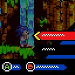
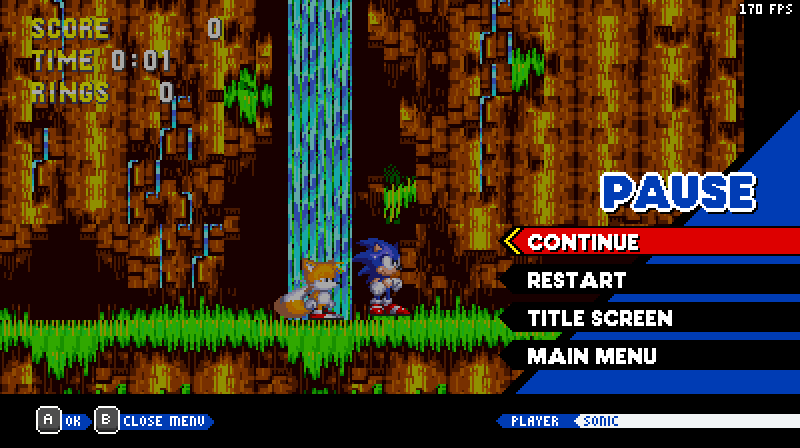
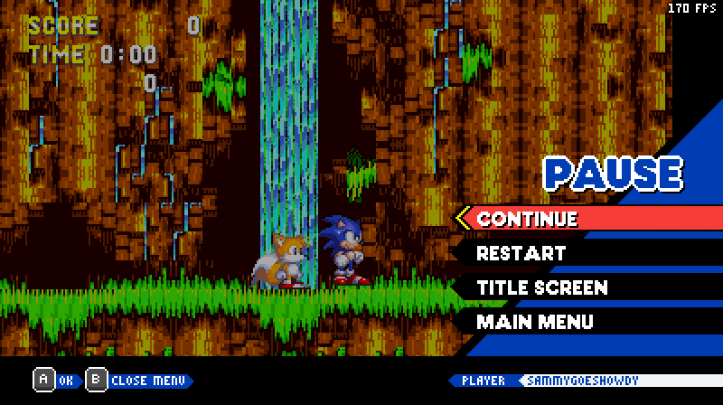

# Sonic Origins Pause Menu

<font color="red">*THIS MOD REQUIRES [SONIC 3 A.I.R. 25.02.15.0](https://github.com/Eukaryot/sonic3air/releases/tag/v25.02.15.0-test) OR NEWER, OLDER VERSIONS WILL NOT WORK.*</font>

This mod is an accurate recreation of the Sonic Origins pause menu for Sonic 3 A.I.R.



## List of features:

* Multi-language support. (English, Español, Français, Português (Brazil))

* Support for [Achievements Plus](https://github.com/fadeinside/s3air-achievements-plus), shows your coin amount on the pause menu (Optional)

* 

## Modding:
To add support, simply check if the player is playing as your character, if so, return your characters name, otherwise return the original function.

For example, if your character uses the MISC framework your code would be like this

```cpp
// Thanks Raine/Nabbup for letting me use Amy Galore code!
function string Origins.getCharacterPlayerName(u8 character)
{
    if (Origins.PlayerBarName != 0 || (character != CHARACTER_AMY && character != CHARACTER_AMY_TAILS))
        return base.Origins.getCharacterPlayerName(character)
    return "AMY"
}
```

## FAQ:

**Q. Will you add support for Sonic 3 A.I.R. with Extra Mushrooms?**<br>
A. No, this mod hasn't been updated for a year (as of writing) now. The creator herself doesn't even want you using it because the mod in general isn't very well coded. 

**Q. I want a different username, how do I change it?**  
A. Here's how to add a custom username:
    
1. Open Sonic 3 A.I.R, then go to options, and find the mod.
2. Set "Username Display" to "yuzu"
3. Close the options menu, and then exit the game
4. Go into the mods files, then go to scripts\main.lemon 
5. Go to line 208, then change `return "yuzu"` to whatever you wish, in my case; I want the username "SammyGoesHowdy", so I'd put in `return "SammyGoesHowdy"`
6. Save the file, then go back to Sonic 3 A.I.R.
7. Go into game, and pause
8. Result:



### NOTE: Please do not distribute builds that contain this modified code.